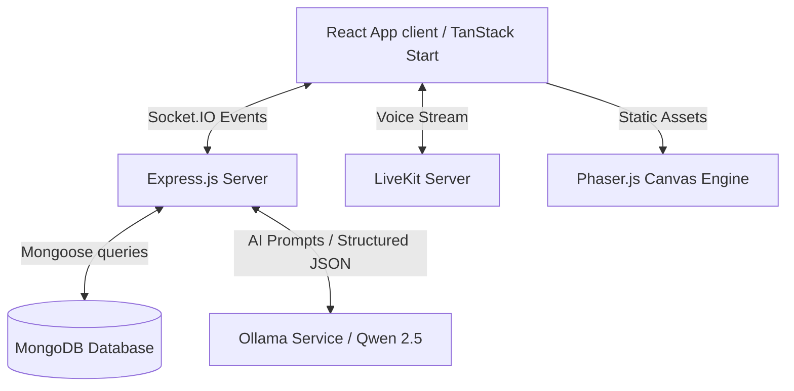

# 4-bits: AI-Powered Multiplayer Murder Mystery Game

💻 **Frontend Live**: [https://hacksprint-frontend.onrender.com/](https://hacksprint-frontend.onrender.com/)  
⚙️ **Backend Live**: [https://four-bits.onrender.com](https://four-bits.onrender.com)

---

[](https://reactjs.org/)
[](https://phaser.io/)
[](https://tailwindcss.com/)
[](https://expressjs.com/)
[](https://www.mongodb.com/)
[](https://socket.io/)
[](https://ollama.com/)

An immersive, real-time multiplayer murder mystery roleplaying experience. The game leverages modern web technologies, 2D gaming canvases, and a local/remote **Ollama instance (Qwen 2.5)** to create dynamic, context-aware mystery stories, suspect interrogations, and interactive crime scenes.

---

## 📖 Project Overview

**4-bits** takes traditional social deduction murder mystery games and elevates them with artificial intelligence. Instead of static, pre-written cases, the game generates fresh mysteries on the fly:
1. **Dynamic Character Generation**: Players receive character dossiers outlining their relationship to the victim, motives, items, and alibis.
2. **Interactive Crime Scene**: Using a visual 2D interactive map, players move their avatars to search for hidden items and collect clues.
3. **AI-Driven Interrogations**: Engage in dialogue where suspects react defensively, adapt to evidence, or deflect blame based on AI-moderated prompts.
4. **Intelligent Accusation & Verdict**: Players present their cases to the AI Game Master, who dynamically evaluates their theories and reveals the truth.

---

## 🎮 Core Gameplay & In-Game Features

The game is structured around several distinct phases that take players from room initialization to the final verdict:

### 1. 🚪 Room Initialization & Suspect Lobby
- **Multiplayer Lobbies**: Create or join private game rooms using generated alphanumeric room codes.
- **Dynamic Suspect Assignments**: Players are assigned distinct character roles (e.g., suspects with specific ties to the victim).
- **Personalized Dossiers**: Once the room starts, players receive a detailed character briefing document with secret motives, relationship networks, personal secrets, and their alibi.

### 2. 🔍 Visual 2D Investigation (Phaser.js)
- **Interactive Crime Scene Navigation**: Players navigate a 2D map using WASD or arrow keys.
- **Evidence & Hotspots**: Inspect interactive items, bodies, furniture, and points of interest spread around the map to uncover hidden physical evidence.
- **Evidence Board (Virtual Corkboard)**: A corkboard UI that visually maps out all discovered clues, suspect cards, and linked files for all players to reference.

### 3. 💬 Interrogations & AI NPC Dialogue
- **Generative AI Suspect Responses**: Ask custom text questions to suspects. A self-hosted or remote **Ollama model (Qwen 2.5)** powers context-aware, defensive, or revealing dialogue from non-player suspect characters based on player evidence.
- **Investigation Logs**: A unified log that records all suspect responses, clue discoveries, and global game events.

### 4. 🗣️ Real-time Meetings & Live Debates
- **Spatial Voice Chat (LiveKit)**: Integrate voice channels allowing players to debate, accuse, and negotiate in real-time.
- **Voice Controls**: Complete audio options including toggleable mute, deafen, volume controls, and talking indicator state icons mapped on Phaser avatars.
- **Emergency / Discussion Meetings**: Timed discussion rounds with programmatic ticking audio and visual layouts to guide debates.

### 5. ⚖️ Voting & Trial Phase
- **Accusation Voting**: A voting interface where players submit their final choice for the murderer.
- **Structured Verdicts**: The Qwen AI evaluates the voting results, matches player theories against the generated crime truth, and outputs a custom, narrative ending wrap-up.

---

## 🏗️ System Architecture

The project follows a split full-stack client-server architecture:



---

## 🛠️ Technical Stack & Tooling

### Frontend
*   **Framework**: [React 19](https://react.dev/) using [TanStack Start](https://tanstack.com/start) (File-based SSR & Routing)
*   **Game Loop**: [Phaser 3](https://phaser.io/)
*   **Styling**: [Tailwind CSS v4](https://tailwindcss.com/)
*   **Networking**: [Socket.IO Client](https://socket.io/docs/v4/client-api/)
*   **Bundler & Preset**: [Vite](https://vite.dev/) powered by [Nitro Engine](https://nitro.unjs.io/) (with the standalone `node-server` preset)

### Backend
*   **Server Framework**: [Express.js](https://expressjs.com/) on Node.js
*   **Database**: [MongoDB](https://www.mongodb.com/) via [Mongoose](https://mongoosejs.com/)
*   **Real-time Communication**: [Socket.IO Server](https://socket.io/docs/v4/server-api/)
*   **AI Engine**: [Ollama](https://ollama.com/) (running `qwen2.5` or `qwen3`)
*   **SDKs**: `livekit-server-sdk`

---

## ⚙️ Environment Variables Config

### 1. Backend (`/backend/.env`)
Create a file at `backend/.env` with the following variables:
```env
PORT=5000
NODE_ENV=development
MONGODB_URI=mongodb+srv://<username>:<password>@<cluster>.mongodb.net/<dbname>
OLLAMA_BASE_URL=http://localhost:11434
OLLAMA_MODEL=qwen2.5
LIVEKIT_API_KEY=your_livekit_api_key
LIVEKIT_API_SECRET=your_livekit_secret
```

### 2. Frontend (`/frontend/.env`)
Create a file at `frontend/.env` with:
```env
VITE_API_URL=http://localhost:5000
```

---

## 📦 Installation & Local Setup

### Prerequisites
- Node.js (v18+)
- MongoDB running locally or a MongoDB Atlas connection URI
- Ollama installed locally with the target model (e.g. `ollama run qwen2.5`)

### 1. Setup Backend
```bash
cd backend
npm install
npm run dev
```
The backend server runs on `http://localhost:5000`.

### 2. Setup Frontend
```bash
cd ../frontend
npm install
npm run dev
```
The client application will start at `http://localhost:3000`.

---

## ☁️ Production Deployment (Render)

This repository includes a `render.yaml` configuration in the root directory for automated blueprint deployments.

### Option A: Deployment via Blueprints (Recommended)
1. In your **Render Dashboard**, click **+ New** -> **Blueprint**.
2. Link your GitHub repository `4-bits`.
3. Provide values for the required environment variables:
   - For backend: `MONGODB_URI`, `OLLAMA_BASE_URL` (your hosted/tunnelled Ollama endpoint), `LIVEKIT_API_KEY`, `LIVEKIT_API_SECRET`.
   - For frontend: `VITE_API_URL` (using the URL Render creates for your backend service).
4. Click **Apply**.

### Option B: Manual Frontend Web Service Deployment
If deploying manually:
1. Create a **New Web Service** (not a Static Site).
2. Configure as follows:
   - **Root Directory**: `frontend`
   - **Build Command**: `npm install --include=dev && npm run build`
   - **Start Command**: `node .output/server/index.mjs`
3. Add the following **Environment Variables**:
   - `NITRO_PRESET`: `node-server`
   - `PORT`: `3000`
   - `NODE_ENV`: `production`
   - `VITE_API_URL`: *[Your backend Render service URL]*
4. Choose the **Free** tier and click **Create Web Service**.

---

## 📄 License
This project is licensed under the MIT License.

---
**Made by Team 4-bits** ❤️